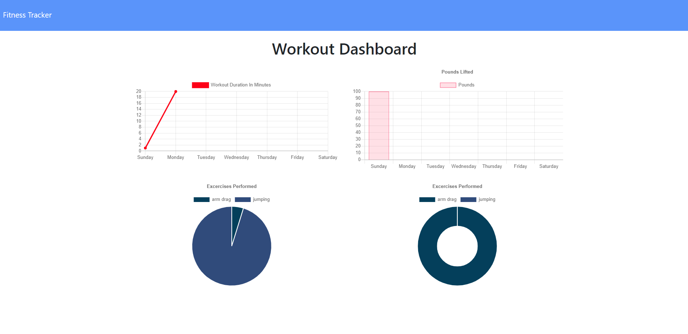
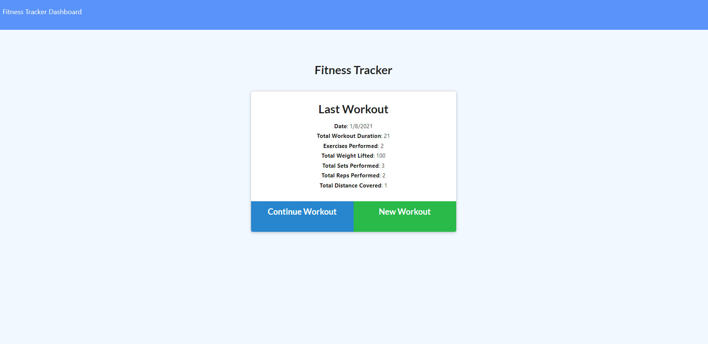
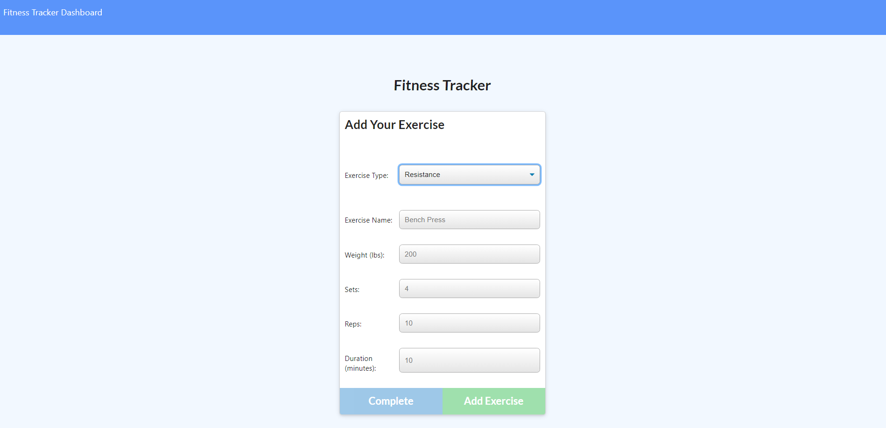

# 17-Workout Tracker

## Table of Contents

* [Description](#description)
* [Installation](#installation)
* [Usage](#usage)
* [Questions](#questions)

## Description 

The ability to keep track of excersises and workouts shouldn't be as entensive as the actual workout. This application will allow you to create and track daily workouts, log multiple excersises and track the details of your excersise.

## Installation

Application is hosted on Heroku. Please follow the link to the app.

https://fathomless-journey-73188.herokuapp.com/

## Usage 

As a user can view, create and track daily workouts. The user will also be able to log multiple exercises in a workout on a given day. Viewing the combined weight of multiple excersises from past seven workouts should be listed on the Stats Page. Also located on the Stats page is a total duration of each workout from the past seven days.

## Questions

* https://github.com/robertsantos-dfw/17-WorkoutTracker

You can reach me by emailing me at robertsantos.dfw@gmail.com with any additional questions.

## Screenshots

* Dashboard

* Fitness Tracker

* Add Excersise

---
© 2019 Trilogy Education Services, a 2U, Inc. brand. All Rights Reserved.
